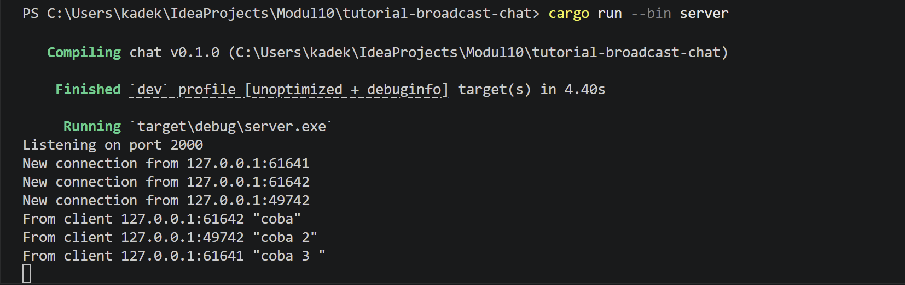
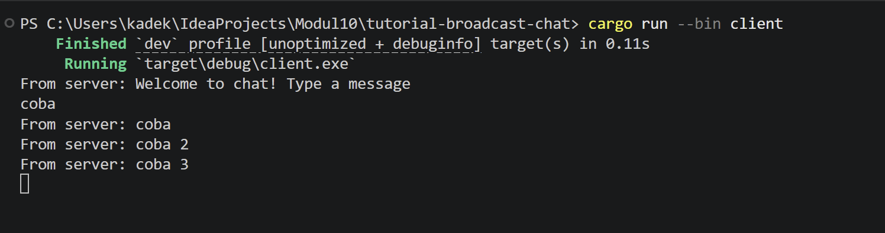
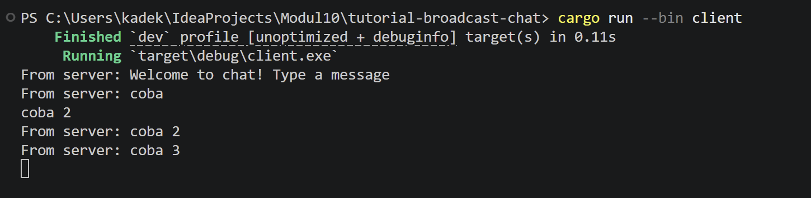
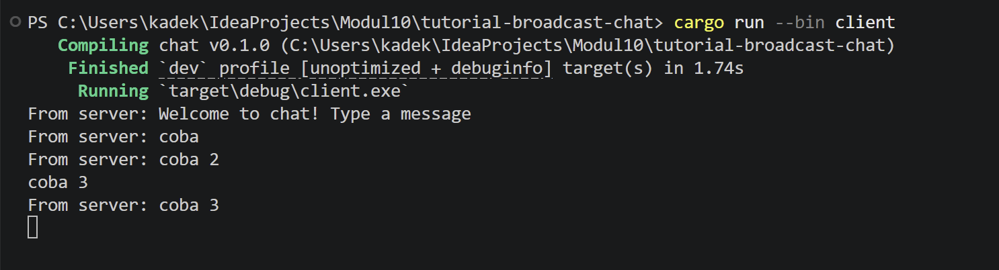
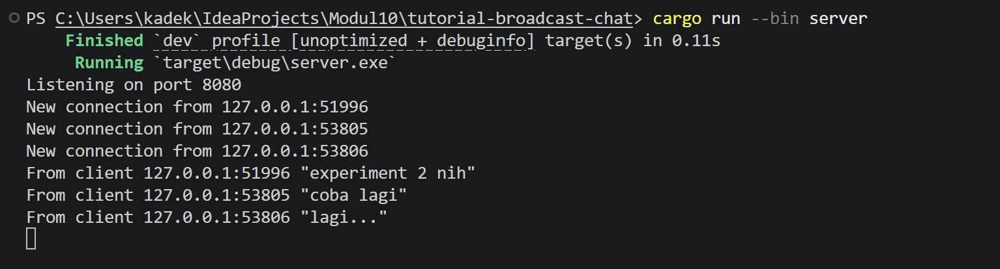
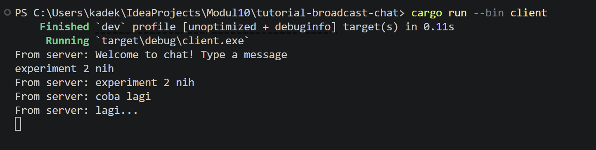
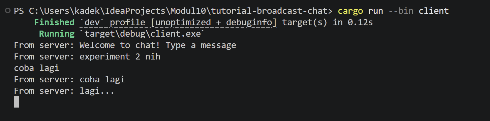
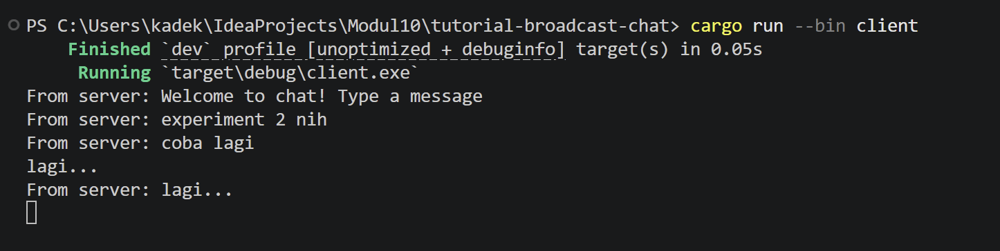

# Tutorial 10 Asynchronous Programming (Bagian 2)

### Experiment 2.1: Original code of broadcast chat. 
Cara menjalankan: buka 4 terminal. Terminal 1 jalankan server dengan `cargo run --bin server`. Terminal 2, 3, 4 jalankan client dengan `cargo run --bin client`. Ketika kita mengetik pesan di salah satu client dan menekan Enter, server akan menerima pesan tersebut dan mem-broadcast ke semua client yang terhubung melalui channel broadcast Tokio.

Screenshots:
server

clients

### Experiment 2.2: Modifying the websocket port 
Port diubah di dua file: `server.rs` (di `TcpListener::bind`) dan `client.rs` (di `ClientBuilder::from_uri`). Keduanya menggunakan protokol WebSocket (`ws://`). Server mendefinisikan port yang di-listen, dan client harus mengarah ke port yang sama. Protokol WebSocket (`ws://`) didefinisikan di URI string pada client dan secara implisit di `ServerBuilder` pada server.

Screenshots:
server

clients

