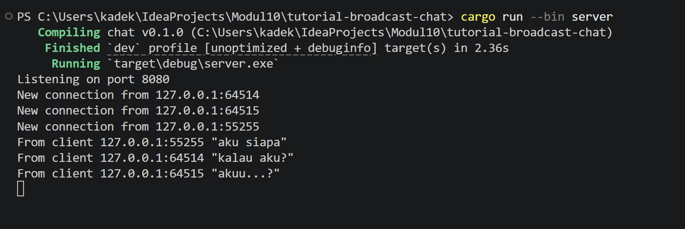
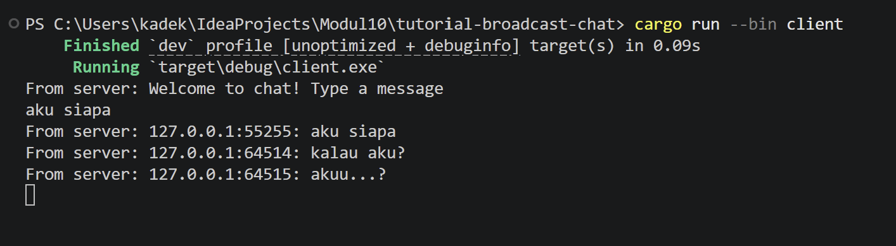
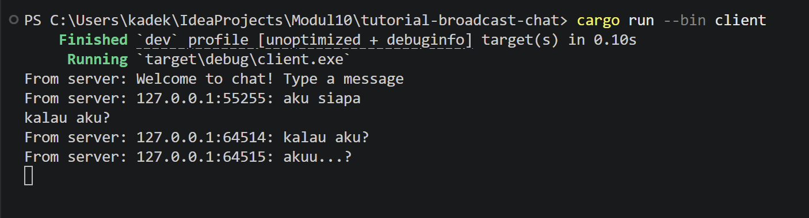
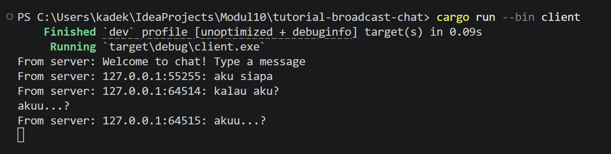
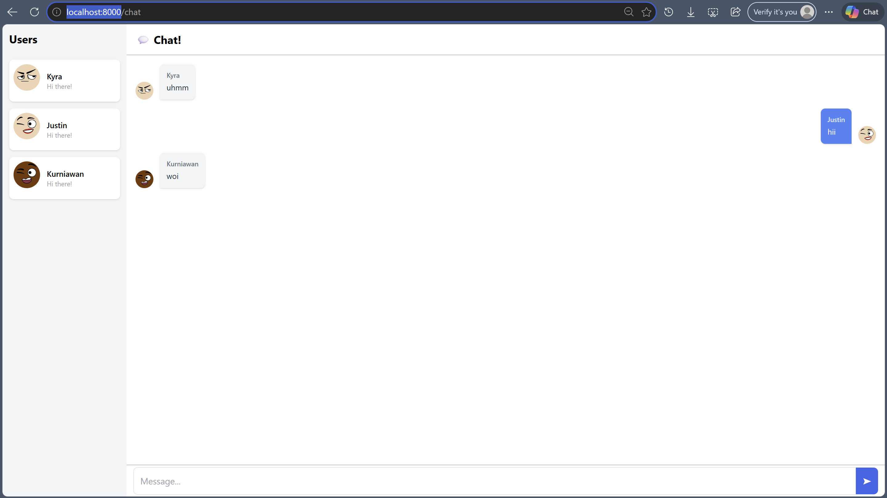

# Tutorial 10 Asynchronous Programming (Bagian 2)

### Experiment 2.1: Original code of broadcast chat. 
Cara menjalankan: buka 4 terminal. Terminal 1 jalankan server dengan `cargo run --bin server`. Terminal 2, 3, 4 jalankan client dengan `cargo run --bin client`. Ketika kita mengetik pesan di salah satu client dan menekan Enter, server akan menerima pesan tersebut dan mem-broadcast ke semua client yang terhubung melalui channel broadcast Tokio.

Screenshots:
server

clients

### Experiment 2.2: Modifying the websocket port 
Port diubah di dua file: `server.rs` (di `TcpListener::bind`) dan `client.rs` (di `ClientBuilder::from_uri`). Keduanya menggunakan protokol WebSocket (`ws://`). Server mendefinisikan port yang di-listen, dan client harus mengarah ke port yang sama. Protokol WebSocket (`ws://`) didefinisikan di URI string pada client dan secara implisit di `ServerBuilder` pada server.

Screenshots:
server

clients

### Experiment 2.3: Small changes, add IP and Port
Perubahan dilakukan di `server.rs` pada fungsi `handle_connectio`n`. Sebelumnya pesan di-broadcast apa adanya. Sekarang pesan dibungkus dengan format!("{addr}: {text}") sehingga menyertakan IP dan port pengirim. Ini membantu client mengetahui siapa yang mengirim pesan, karena setiap koneksi TCP memiliki port unik yang mengidentifikasi masing-masing client.

Screenshots:
server

clients

### Bonus: Rust Websocket server for YewChat!

Server dari Tutorial 2 dimodifikasi untuk bisa melayani YewChat dari Tutorial 3.
Perbedaan utama adalah format pesan:
- Tutorial 2 menggunakan plain text
- Tutorial 3 menggunakan JSON dengan format:
  `{"messageType":"...","dataArray":[...],"data":"..."}`

Modifikasi yang dilakukan pada server.rs:
1. Menambahkan struct WebSocketMessage untuk parse/serialize JSON
2. Menambahkan UserList (Arc<Mutex<Vec<String>>>) untuk menyimpan daftar user yang terhubung
3. Menambahkan handler untuk messageType "register". Menyimpan username dan broadcast user list terbaru
4. Menambahkan handler untuk messageType "message". Membungkus pesan dengan format JSON yang diexpect oleh YewChat client
5. Menambahkan cleanup saat client disconnect

YewChat mengirim semua pesan sebagai satu string JSON melalui WebSocket. Meskipun formatnya JSON, tetap dikirim sebagai text message biasa di level WebSocket protocol. Jadi server Rust cukup parse string tersebut sebagai JSON menggunakan serde_json, proses sesuai messageType-nya, lalu broadcast kembali dalam format JSON yang dimengerti client.

`Q: which one you prefer, the javascript version or the Rust version`
Saya prefer versi Rust karena:
1. Type safety, serde memastikan struktur JSON selalu valid
2. Performance Rust lebih efisien dalam memory dan CPU
3. Konsistensi frontend dan backend sama-sama menggunakan Rust
Namun versi JavaScript terlihat lebih mudah dan lebih familiar. 